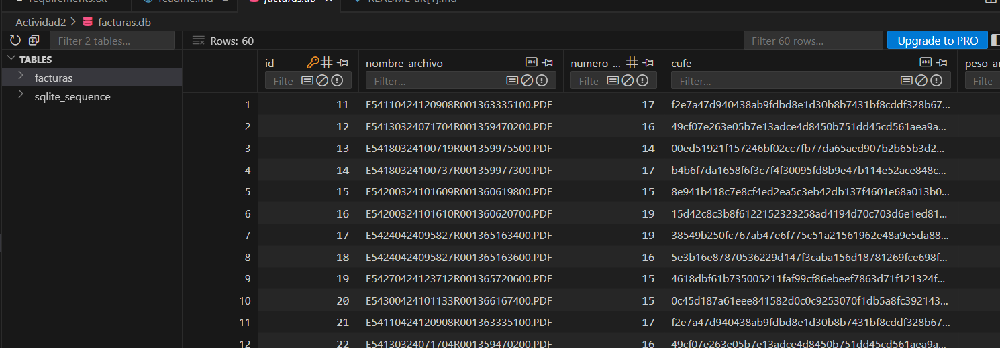

# Prueba Técnica – Extracción de Datos de Facturas en PDF

Este proyecto corresponde a un script en **Python** que permite procesar facturas en formato **PDF** y registrar la información más relevante en una base de datos **SQLite**.  

Los datos que se extraen de cada archivo son:  
- **Nombre del archivo**  
- **Cantidad de páginas**  
- **CUFE** (capturado mediante la expresión regular `\b([0-9a-fA-F]\n*){95,100}\b`)  
- **Tamaño en bytes**  

El CUFE se localiza leyendo cada página del documento hasta identificar la primera coincidencia con el patrón.

---

## Características Principales

- **Procesamiento de PDFs:** Todos los documentos que se ubiquen en la carpeta `pdfs` serán leídos automáticamente.  
- **Registro en SQLite:** Los resultados se guardan en una base de datos local llamada `facturas.db`.  
- **Control de duplicados:** Si un archivo ya fue procesado con anterioridad, el sistema preguntará si se desea reemplazar la información.  
- **Uso desde consola:** La herramienta se ejecuta directamente en la terminal con un único comando.  

---

## Requisitos Previos

Para poder ejecutar el proyecto necesitas:  

- Python **3.12.9** o superior  
- Librería **PyMuPDF** (para la manipulación de archivos PDF)  

SQLite está integrado en Python, por lo que no es necesario instalar nada adicional para manejar la base de datos.

---

## Instalación y Puesta en Marcha

1. **Descargar el repositorio**  
   ```bash
   git clone https://github.com/yinamq19-netizen/Actividad2.git
   cd Actividad2
   ```

2. **(Opcional) Crear un entorno virtual**  
   - En Windows:  
     ```bash
     python -m venv venv
     venv\Scripts\activate
     ```
   - En Linux / MacOS:  
     ```bash
     python3 -m venv venv
     source venv/bin/activate
     ```

3. **Instalar dependencias**  
   ```bash
   pip install -r requirements.txt
   ```

---

## Estructura de Archivos

```
prueba_adres_2/
│── consulta_interactiva.py          # Script principal
│── extraer_cufe.py     # Funciones auxiliares
│── pdfs/      # Carpeta con facturas de ejemplo en PDF
│── imagen/          # Capturas de funcionamiento
│── facturas.db      # Base de datos SQLite (se crea al ejecutar el script)
│── requirements.txt # Dependencias


---

## Ejecución

1. Coloca tus **facturas en PDF** dentro de la carpeta `pdfs`.  
2. Desde la terminal, ejecuta:  
   ```bash
   python main.py
   ```  
3. El script recorrerá cada archivo, extraerá los datos solicitados y los guardará en `facturas.db`.  
4. Si un documento ya existe en la base de datos, se solicitará confirmación antes de reemplazar los registros previos.  

---

## Ejemplo Visual

- Vista de la base de datos después de ejecutar el script:



> En este caso se utilizó la extensión [SQLite Viewer](https://marketplace.visualstudio.com/items?itemName=qwtel.sqlite-viewer) en **Visual Studio Code** para verificar los registros almacenados.

---

Autor: **Yina Millan**  

